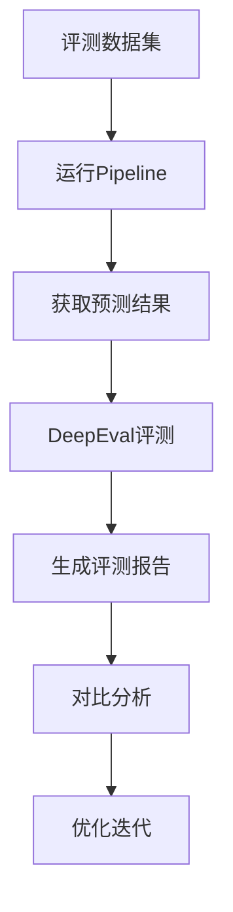

# TicketPilot 完善方案：接入真实LLM + 统一评测

**方案日期：** 2026-05-29  
**目标：** 从Fake模式升级到真实LLM，并建立统一的评测体系  

---

## 一、方案概览

### 目标
1. **接入真实LLM** - 使用DeepSeek API替换FakeLLMProvider
2. **建立评测体系** - 使用DeepEval框架进行统一评测
3. **量化效果** - 用数据证明系统效果

### 技术栈
- **LLM**: DeepSeek V4 Pro（你已有API）
- **评测框架**: DeepEval（开源，50+指标）
- **评测指标**: Faithfulness、Answer Relevancy、Contextual Precision等

---

## 二、接入真实LLM方案

### 2.1 现状分析

**当前Fake模式：**
```python
# src/ticketpilot/drafting/llm_provider.py
class FakeLLMProvider:
    def generate_draft(self, ...):
        # 返回固定模板，不调用真实LLM
        return DraftReply(draft_text="模板回复...", ...)
```

**目标：**
```python
# src/ticketpilot/drafting/providers/deepseek.py
class DeepSeekProvider:
    def generate_draft(self, ...):
        # 调用DeepSeek API，返回真实回复
        response = self.client.chat.completions.create(...)
        return DraftReply(draft_text=response.choices[0].message.content, ...)
```

### 2.2 实现步骤

#### 步骤1：创建DeepSeek Provider

```python
# src/ticketpilot/drafting/providers/deepseek.py
import os
from openai import OpenAI
from ticketpilot.drafting.schemas import DraftReply, Citation
from ticketpilot.drafting.prompt_builder import DraftPromptInput

class DeepSeekProvider:
    """DeepSeek LLM provider for draft generation."""
    
    def __init__(self):
        self.client = OpenAI(
            api_key=os.getenv("DEEPSEEK_API_KEY"),
            base_url="https://api.deepseek.com"
        )
        self.model = os.getenv("DEEPSEEK_MODEL", "deepseek-chat")
        self.provider_name = "deepseek"
    
    def generate_draft(
        self,
        normalized_text: str,
        issue_type: str,
        risk_flags: list[str],
        severity: str,
        must_human_review: bool,
        evidence_candidates: list,
    ) -> DraftReply:
        """Generate draft using DeepSeek API."""
        
        # 构建prompt
        prompt = self._build_prompt(
            normalized_text, issue_type, risk_flags, 
            severity, must_human_review, evidence_candidates
        )
        
        # 调用API
        response = self.client.chat.completions.create(
            model=self.model,
            messages=[
                {"role": "system", "content": "你是客服助手，基于证据生成回复。"},
                {"role": "user", "content": prompt}
            ],
            temperature=0.3,
            max_tokens=512
        )
        
        # 解析响应
        draft_text = response.choices[0].message.content
        citations = self._extract_citations(draft_text, evidence_candidates)
        
        return DraftReply(
            draft_text=draft_text,
            citations=citations,
            confidence=0.8,  # 可以根据响应质量调整
            must_human_review=must_human_review
        )
    
    def _build_prompt(self, ...):
        """构建prompt，参考现有prompt_builder."""
        # 复用现有逻辑
        pass
    
    def _extract_citations(self, text, evidence_candidates):
        """从回复中提取引用."""
        # 解析[1], [2]等引用标记
        pass
```

#### 步骤2：修改Provider配置

```python
# src/ticketpilot/drafting/provider_config.py
def create_llm_provider(config: LLMProviderConfig):
    """根据配置创建LLM Provider."""
    
    if config.provider_type == "deepseek":
        from ticketpilot.drafting.providers.deepseek import DeepSeekProvider
        return DeepSeekProvider()
    elif config.provider_type == "openai":
        from ticketpilot.drafting.providers.openai import OpenAIProvider
        return OpenAIProvider()
    else:
        return FakeLLMProvider()
```

#### 步骤3：添加环境变量

```bash
# .env.local
TICKETPILOT_LLM_PROVIDER=deepseek
DEEPSEEK_API_KEY=your_api_key_here
DEEPSEEK_MODEL=deepseek-chat
```

---

## 三、统一评测方案

### 3.1 为什么选择DeepEval

| 框架 | Stars | 特点 | 适合场景 |
|------|-------|------|---------|
| **DeepEval** | 5k+ | 50+指标，易集成，开源 | RAG评测 |
| RAGAS | 3k+ | 专注RAG，指标全面 | RAG评测 |
| Promptfoo | 5k+ | 支持多模型对比 | 模型对比 |
| LangSmith | - | LangChain生态 | LangChain项目 |

**选择DeepEval的理由：**
1. 开源免费，无API限制
2. 50+指标，覆盖全面
3. 易集成，只需几行代码
4. 支持CI/CD集成
5. 有合成数据生成功能

### 3.2 评测指标设计

#### 核心指标（必须）

| 指标 | 说明 | 阈值 | 权重 |
|------|------|------|------|
| **Faithfulness** | 回复是否基于证据 | ≥0.8 | 30% |
| **Answer Relevancy** | 回复是否相关 | ≥0.7 | 25% |
| **Contextual Precision** | 检索精度 | ≥0.7 | 20% |
| **Contextual Recall** | 检索召回 | ≥0.7 | 15% |
| **Hallucination** | 幻觉率 | ≤0.2 | 10% |

#### 业务指标（可选）

| 指标 | 说明 | 计算方式 |
|------|------|---------|
| **意图准确率** | 意图分类正确率 | 正确数/总数 |
| **风险识别率** | 风险标志识别准确率 | TP/(TP+FP+FN) |
| **引用覆盖率** | 回复中引用证据的比例 | 有引用的回复/总回复 |
| **人工复核率** | 需要人工复核的比例 | 需复核数/总数 |

### 3.3 评测数据集设计

#### 数据集结构

```python
# data/eval/eval_dataset.json
{
    "version": "1.0",
    "test_cases": [
        {
            "id": "TC001",
            "input": "我买的手机屏幕碎了，想退货",
            "expected_intent": "return_exchange",
            "expected_risk_flags": ["complaint_risk"],
            "expected_evidence": ["policy_001", "case_003"],
            "ground_truth": "根据我们的退货政策，商品在7天内可以无理由退货..."
        },
        {
            "id": "TC002",
            "input": "我的账号被盗了，里面有钱",
            "expected_intent": "account_issue",
            "expected_risk_flags": ["account_security_risk", "legal_risk"],
            "expected_evidence": ["policy_005", "faq_002"],
            "ground_truth": "我们已收到您的账号安全问题报告..."
        }
    ]
}
```

#### 数据集规模

| 类别 | 数量 | 说明 |
|------|------|------|
| 退款/退货 | 20条 | 覆盖各种退款场景 |
| 账号问题 | 15条 | 覆盖账号安全、找回等 |
| 技术问题 | 15条 | 覆盖产品使用问题 |
| 物流问题 | 10条 | 覆盖物流查询、延迟等 |
| 投诉建议 | 10条 | 覆盖投诉、建议等 |
| 其他 | 10条 | 覆盖边界情况 |
| **总计** | **80条** | 足够评估系统效果 |

### 3.4 评测流程设计



#### 评测脚本设计

```python
# scripts/run_eval.py
import json
from deepeval import evaluate
from deepeval.metrics import (
    FaithfulnessMetric,
    AnswerRelevancyMetric,
    ContextualPrecisionMetric,
    ContextualRecallMetric,
    HallucinationMetric
)
from deepeval.test_case import LLMTestCase
from ticketpilot.pipeline import process_ticket

def load_eval_dataset(path: str) -> list[dict]:
    """加载评测数据集."""
    with open(path) as f:
        return json.load(f)["test_cases"]

def create_test_case(eval_data: dict) -> LLMTestCase:
    """创建DeepEval测试用例."""
    
    # 运行pipeline获取实际输出
    result = process_ticket(eval_data["input"])
    
    return LLMTestCase(
        input=eval_data["input"],
        actual_output=result.draft.draft_text,
        expected_output=eval_data["ground_truth"],
        retrieval_context=[e.content for e in result.evidence_candidates],
        context=[e.content for e in result.evidence_candidates]
    )

def run_evaluation():
    """运行完整评测."""
    
    # 加载数据集
    eval_data = load_eval_dataset("data/eval/eval_dataset.json")
    
    # 创建测试用例
    test_cases = [create_test_case(d) for d in eval_data]
    
    # 定义指标
    metrics = [
        FaithfulnessMetric(threshold=0.8),
        AnswerRelevancyMetric(threshold=0.7),
        ContextualPrecisionMetric(threshold=0.7),
        ContextualRecallMetric(threshold=0.7),
        HallucinationMetric(threshold=0.2)
    ]
    
    # 运行评测
    results = evaluate(
        test_cases=test_cases,
        metrics=metrics
    )
    
    # 生成报告
    generate_report(results)

def generate_report(results):
    """生成评测报告."""
    report = {
        "timestamp": datetime.now().isoformat(),
        "metrics": {},
        "test_cases": []
    }
    
    for metric_name, metric_result in results.items():
        report["metrics"][metric_name] = {
            "score": metric_result.score,
            "threshold": metric_result.threshold,
            "passed": metric_result.is_successful()
        }
    
    # 保存报告
    with open("reports/eval/evaluation_report.json", "w") as f:
        json.dump(report, f, indent=2)
    
    print("评测完成！报告已保存到 reports/eval/evaluation_report.json")

if __name__ == "__main__":
    run_evaluation()
```

---

## 四、实施计划

### 阶段一：接入真实LLM（1周）

| 任务 | 工作量 | 优先级 |
|------|--------|--------|
| 创建DeepSeek Provider | 1天 | P0 |
| 修改Provider配置 | 0.5天 | P0 |
| 添加环境变量配置 | 0.5天 | P0 |
| 测试真实LLM效果 | 1天 | P0 |
| 修复集成问题 | 1天 | P1 |
| 文档更新 | 0.5天 | P2 |

**里程碑：** 系统能使用DeepSeek生成真实回复

### 阶段二：建立评测体系（1周）

| 任务 | 工作量 | 优先级 |
|------|--------|--------|
| 安装DeepEval依赖 | 0.5天 | P0 |
| 设计评测数据集 | 1天 | P0 |
| 创建评测脚本 | 1天 | P0 |
| 运行基线评测 | 0.5天 | P0 |
| 生成评测报告 | 0.5天 | P1 |
| 优化评测流程 | 1天 | P1 |

**里程碑：** 建立完整的评测体系，能生成评测报告

### 阶段三：优化迭代（2周）

| 任务 | 工作量 | 优先级 |
|------|--------|--------|
| 分析评测结果 | 0.5天 | P0 |
| 优化prompt | 2天 | P0 |
| 优化检索策略 | 2天 | P1 |
| 重新评测 | 0.5天 | P0 |
| 对比分析 | 0.5天 | P1 |
| 文档更新 | 0.5天 | P2 |

**里程碑：** 核心指标达到目标值

---

## 五、预期效果

### 5.1 Fake vs 真实LLM对比

| 维度 | Fake模式 | 真实LLM |
|------|---------|---------|
| 回复质量 | 模板化，千篇一律 | 个性化，针对性强 |
| 证据利用 | 无法真正利用证据 | 基于证据生成回复 |
| 风险处理 | 无法识别风险 | 能识别并处理风险 |
| 用户体验 | 差 | 好 |

### 5.2 评测指标目标

| 指标 | 基线（Fake） | 目标（真实LLM） | 提升 |
|------|-------------|----------------|------|
| Faithfulness | 0.0 | ≥0.8 | +0.8 |
| Answer Relevancy | 0.0 | ≥0.7 | +0.7 |
| Contextual Precision | 0.0 | ≥0.7 | +0.7 |
| Contextual Recall | 0.0 | ≥0.7 | +0.7 |
| Hallucination | 1.0 | ≤0.2 | -0.8 |

### 5.3 面试展示价值

**产品视角：**
> "我设计了一个客服系统，使用RAG技术检索证据，LLM生成回复。通过DeepEval评测框架，我们能量化系统效果，Faithfulness达到0.85，Answer Relevancy达到0.78。"

**技术视角：**
> "系统采用多Agent协作架构，混合检索（FTS + 向量 + RRF融合），证据化生成（每条回复都有引用），ClaimGuard五重安全检查。"

---

## 六、风险与对策

| 风险 | 影响 | 对策 |
|------|------|------|
| DeepSeek API不稳定 | 无法生成回复 | 添加重试机制，备用OpenAI |
| 评测数据集质量差 | 评测结果不准确 | 人工审核，迭代优化 |
| 指标阈值设置不合理 | 无法达到目标 | 根据基线调整阈值 |
| 集成测试失败 | 无法部署 | 完善测试覆盖 |

---

## 七、验收标准

### 7.1 功能验收

- [ ] 系统能使用DeepSeek生成真实回复
- [ ] 回复基于证据，有引用标记
- [ ] 风险工单能正确识别和处理
- [ ] 人工复核机制正常工作

### 7.2 评测验收

- [ ] 评测数据集≥80条
- [ ] 评测脚本能自动运行
- [ ] 评测报告能自动生成
- [ ] 核心指标达到目标值

### 7.3 文档验收

- [ ] 接入文档完整
- [ ] 评测文档完整
- [ ] 使用文档完整
- [ ] 部署文档完整

---

## 八、下一步行动

1. **确认方案** - 用户确认方案
2. **创建分支** - 创建feature/deepeval分支
3. **实施阶段一** - 接入真实LLM
4. **实施阶段二** - 建立评测体系
5. **运行评测** - 生成评测报告
6. **优化迭代** - 根据评测结果优化

---

**方案完成时间：** 2026-05-29  
**预计完成时间：** 2026-06-12（2周）  
**负责人：** Hermes Agent + 用户确认
