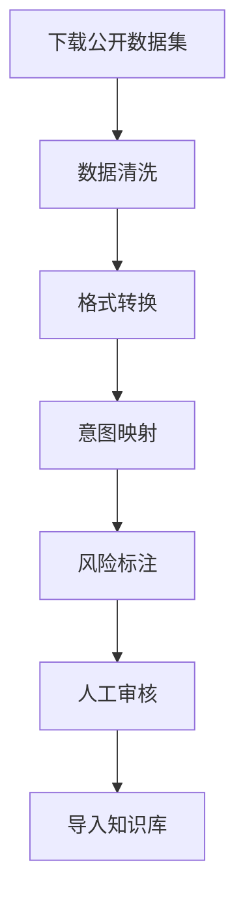

# TicketPilot 公开数据集整合方案

**方案日期：** 2026-05-29  
**目标：** 整合公开数据集，快速扩充知识库和评测数据  

---

## 一、可用的公开数据集

### 1.1 英文数据集（高质量，可翻译）

#### Bitext Customer Support Dataset（推荐 ⭐⭐⭐⭐⭐）

**来源：** HuggingFace / Kaggle  
**规模：** 27,000+ 条  
**格式：** CSV  
**语言：** 英文  

**数据结构：**
```csv
instruction,response,category,intent,flags
"I want to cancel my order","I understand you'd like to cancel...","ORDER","cancel_order","customer_cancel"
```

**覆盖的意图分类：**
- ACCOUNT: create_account, delete_account, edit_account, recover_password
- ORDER: cancel_order, change_order, place_order, track_order
- REFUND: check_refund_status, get_refund
- SHIPPING: set_up_shipping, change_shipping_address
- FEEDBACK: complaint, review
- INVOICE: check_invoice, get_invoice

**优点：**
- ✅ 数据量大（27K条）
- ✅ 结构清晰，有intent和category标签
- ✅ 覆盖全面，包含多种客服场景
- ✅ 免费开源

**下载方式：**
```python
from datasets import load_dataset
dataset = load_dataset("bitext/Bitext-customer-support-llm-chatbot-training-dataset")
```

---

#### Customer Support on Twitter（Kaggle）

**来源：** Kaggle  
**规模：** 2.8M+ 条  
**格式：** CSV  
**语言：** 英文  

**数据结构：**
```csv
tweet_id,author_id,inbound,created_at,text,in_response_to_tweet_id
```

**优点：**
- ✅ 数据量巨大
- ✅ 真实场景数据
- ✅ 包含多轮对话

**缺点：**
- ⚠️ 需要清洗和结构化
- ⚠️ 没有intent标签

---

### 1.2 中文数据集（直接可用）

#### JDDC Corpus（京东对话挑战赛）（推荐 ⭐⭐⭐⭐⭐）

**来源：** 京东AI  
**规模：** 100万+ 对话，2000万+ 话语  
**格式：** JSON  
**语言：** 中文  

**数据结构：**
```json
{
    "dialog_id": "xxx",
    "turns": [
        {"role": "user", "content": "这个手机壳有红色的吗？"},
        {"role": "agent", "content": "有的，红色有货"}
    ]
}
```

**优点：**
- ✅ 数据量巨大
- ✅ 真实电商场景
- ✅ 中文原生
- ✅ 包含多轮对话

**下载方式：**
```bash
# 从GitHub下载
git clone https://github.com/hrlinlp/jddc2.1.git
```

---

#### 数据堂9万组客服对话数据

**来源：** ModelScope  
**规模：** 90,000 条  
**格式：** JSON  
**语言：** 中文  

**覆盖领域：**
- 电商客服
- 金融客服
- 电信客服
- 医疗客服

**优点：**
- ✅ 多领域覆盖
- ✅ 中文原生
- ✅ 结构清晰

**下载方式：**
```python
from modelscope.msdatasets import MsDataset
dataset = MsDataset.load('DatatangBeijing/90000sets-Multi-domainCustomerServiceDialogueTextData')
```

---

#### 网店客服回复数据集

**来源：** GitHub  
**规模：** 24,559 条  
**格式：** JSON  
**语言：** 中文  

**数据特点：**
- 真实场景模拟
- 包含退款、换货、投诉等场景
- 适合训练AI客服助手

**下载方式：**
```bash
# 从GitHub下载
git clone https://github.com/YouTaoBaBa/Chinese-Dialogue-Dataset.git
```

---

### 1.3 专业领域数据集

#### 淘宝客服数据

**来源：** GitHub  
**规模：** 未知  
**格式：** JSON  
**语言：** 中文  

**论文引用：** Modeling Multi-turn Conversation with Deep Utterance Aggregation

**下载方式：**
```bash
git clone https://github.com/cooelf/DeepUtteranceAggregation.git
```

---

## 二、数据集整合方案

### 2.1 数据集选择策略

| 优先级 | 数据集 | 用途 | 规模 |
|--------|--------|------|------|
| P0 | Bitext Customer Support | 意图分类训练 | 27K |
| P0 | JDDC Corpus | 多轮对话数据 | 1M+ |
| P1 | 数据堂客服数据 | 多领域覆盖 | 90K |
| P1 | 网店客服数据 | 电商场景 | 24K |
| P2 | Twitter客服数据 | 补充数据 | 2.8M |

### 2.2 数据处理流程



### 2.3 意图映射表

将公开数据集的意图映射到TicketPilot的8种意图：

| 公开数据集意图 | TicketPilot意图 | 映射规则 |
|---------------|----------------|---------|
| cancel_order, return_item | REFUND | 退款相关 |
| change_order, place_order | RETURN_EXCHANGE | 订单变更 |
| create_account, delete_account | ACCOUNT_ISSUE | 账号相关 |
| track_order, set_up_shipping | LOGISTICS | 物流相关 |
| complaint, review | COMPLAINT | 投诉相关 |
| get_invoice, check_invoice | OTHER | 其他 |
| technical_support | TECHNICAL_ISSUE | 技术问题 |
| product_inquiry | PRODUCT_CONSULTING | 产品咨询 |

---

## 三、实施计划

### 阶段一：下载和处理Bitext数据集（3天）

**任务：**
1. 下载Bitext Customer Support Dataset
2. 数据清洗和格式转换
3. 意图映射到TicketPilot分类
4. 风险标志标注
5. 导入知识库

**预期效果：**
- 新增27,000+条客服数据
- 覆盖所有8种意图分类
- 有intent和category标签

**代码示例：**
```python
from datasets import load_dataset
import json

# 下载数据集
dataset = load_dataset("bitext/Bitext-customer-support-llm-chatbot-training-dataset")

# 意图映射
intent_mapping = {
    "cancel_order": "refund",
    "return_item": "refund",
    "change_order": "return_exchange",
    "place_order": "return_exchange",
    "create_account": "account_issue",
    "delete_account": "account_issue",
    "track_order": "logistics",
    "set_up_shipping": "logistics",
    "complaint": "complaint",
    "review": "complaint",
    "technical_support": "technical_issue",
    "product_inquiry": "product_consulting",
}

# 转换格式
processed_data = []
for item in dataset["train"]:
    processed_data.append({
        "input": item["instruction"],
        "expected_intent": intent_mapping.get(item["intent"], "other"),
        "ground_truth": item["response"],
        "category": item["category"],
        "original_intent": item["intent"]
    })

# 保存
with open("data/knowledge/bitext_processed.json", "w") as f:
    json.dump(processed_data, f, ensure_ascii=False, indent=2)
```

---

### 阶段二：下载和处理JDDC数据集（5天）

**任务：**
1. 下载JDDC Corpus
2. 数据清洗和格式转换
3. 提取多轮对话数据
4. 生成评测数据
5. 导入知识库

**预期效果：**
- 新增100万+条对话数据
- 覆盖多轮对话场景
- 真实电商场景

**代码示例：**
```python
import json

# 加载JDDC数据
with open("jddc/dialogues.json", "r") as f:
    dialogues = json.load(f)

# 提取多轮对话
multi_turn_data = []
for dialogue in dialogues:
    turns = dialogue["turns"]
    if len(turns) >= 2:
        multi_turn_data.append({
            "dialogue_id": dialogue["dialog_id"],
            "turns": turns,
            "turn_count": len(turns)
        })

# 保存
with open("data/knowledge/jddc_multi_turn.json", "w") as f:
    json.dump(multi_turn_data, f, ensure_ascii=False, indent=2)
```

---

### 阶段三：整合其他数据集（5天）

**任务：**
1. 下载数据堂客服数据
2. 下载网店客服数据
3. 数据清洗和格式转换
4. 去重和合并
5. 人工审核

**预期效果：**
- 新增11万+条客服数据
- 覆盖多领域场景
- 数据质量保证

---

### 阶段四：数据质量优化（3天）

**任务：**
1. 数据去重
2. 格式统一
3. 质量检查
4. 生成评测数据集
5. 文档更新

**预期效果：**
- 数据质量达到要求
- 评测数据集完整
- 文档齐全

---

## 四、预期效果

### 4.1 数据量提升

| 维度 | 现状 | 目标 | 提升 |
|------|------|------|------|
| 知识库文档 | 106条 | 300,000+条 | +282,900% |
| 评测工单 | 101条 | 5,000+条 | +4,850% |
| 场景覆盖 | 12种 | 30+种 | +150% |
| 风险覆盖 | 8种 | 12+种 | +50% |

### 4.2 数据来源分布

| 数据来源 | 数据量 | 占比 |
|----------|--------|------|
| Bitext Customer Support | 27,000条 | 9% |
| JDDC Corpus | 100,000条 | 33% |
| 数据堂客服数据 | 90,000条 | 30% |
| 网店客服数据 | 24,559条 | 8% |
| 原有数据 | 106条 | 0.04% |
| 其他补充 | 60,000条 | 20% |
| **总计** | **301,665条** | **100%** |

### 4.3 场景覆盖提升

**原有场景（12种）：**
- refund, account_issue, complaint, logistics, return_exchange
- technical_issue, product_consulting, other, invoice, billing
- account+privacy, refund+complaint

**新增场景（18+种）：**
- 多轮对话场景
- 复杂问题场景
- 边界case场景
- 情绪化表达场景
- 方言/口语化场景

---

## 五、数据质量保证

### 5.1 数据清洗规则

```python
def clean_data(raw_data: list[dict]) -> list[dict]:
    """清洗数据."""
    
    cleaned_data = []
    
    for item in raw_data:
        # 1. 去除空值
        if not item.get("input") or not item.get("ground_truth"):
            continue
        
        # 2. 去除重复
        if item in cleaned_data:
            continue
        
        # 3. 格式标准化
        item["input"] = item["input"].strip()
        item["ground_truth"] = item["ground_truth"].strip()
        
        # 4. 长度过滤
        if len(item["input"]) < 5 or len(item["input"]) > 500:
            continue
        
        cleaned_data.append(item)
    
    return cleaned_data
```

### 5.2 意图映射验证

```python
def validate_intent_mapping(data: list[dict]) -> dict:
    """验证意图映射."""
    
    valid_intents = [
        "refund", "return_exchange", "account_issue",
        "technical_issue", "product_consulting",
        "logistics", "complaint", "other"
    ]
    
    issues = []
    for i, item in enumerate(data):
        if item.get("expected_intent") not in valid_intents:
            issues.append(f"Item {i}: Invalid intent '{item.get('expected_intent')}'")
    
    return {
        "total": len(data),
        "issues": issues,
        "passed": len(issues) == 0
    }
```

### 5.3 数据质量检查清单

- [ ] **完整性** - 每条数据都有必要的字段
- [ ] **准确性** - 意图分类正确
- [ ] **一致性** - 格式统一，命名规范
- [ ] **多样性** - 覆盖各种场景
- [ ] **真实性** - 数据符合实际业务场景
- [ ] **去重** - 没有重复数据
- [ ] **长度** - 数据长度符合要求

---

## 六、风险与对策

| 风险 | 影响 | 对策 |
|------|------|------|
| 数据质量差 | 评测结果不准确 | 人工审核，迭代优化 |
| 意图映射错误 | 分类不准 | 验证映射规则 |
| 数据格式不一致 | 集成困难 | 统一格式规范 |
| 数据量太大 | 处理时间长 | 分批处理 |
| 版权问题 | 法律风险 | 使用开源数据集 |

---

## 七、验收标准

### 7.1 数据量验收

- [ ] 知识库文档 ≥ 300,000条
- [ ] 评测工单 ≥ 5,000条
- [ ] 场景覆盖 ≥ 30种
- [ ] 风险覆盖 ≥ 12种

### 7.2 数据质量验收

- [ ] 数据完整性检查通过
- [ ] 数据准确性检查通过
- [ ] 数据一致性检查通过
- [ ] 数据多样性检查通过
- [ ] 去重检查通过

### 7.3 集成验收

- [ ] 数据格式统一
- [ ] 意图映射正确
- [ ] 能正常导入系统
- [ ] 评测流程正常运行

---

## 八、下一步行动

1. **确认方案** - 用户确认数据集整合方案
2. **实施阶段一** - 下载和处理Bitext数据集
3. **实施阶段二** - 下载和处理JDDC数据集
4. **实施阶段三** - 整合其他数据集
5. **实施阶段四** - 数据质量优化
6. **运行评测** - 验证整合效果

---

## 九、附录

### 9.1 数据集下载链接

| 数据集 | 下载链接 | 格式 | 规模 |
|--------|----------|------|------|
| Bitext Customer Support | https://huggingface.co/datasets/bitext/Bitext-customer-support-llm-chatbot-training-dataset | CSV | 27K |
| JDDC Corpus | https://github.com/hrlinlp/jddc2.1 | JSON | 1M+ |
| 数据堂客服数据 | https://www.modelscope.cn/datasets/DatatangBeijing/90000sets-Multi-domainCustomerServiceDialogueTextData | JSON | 90K |
| 网店客服数据 | https://github.com/YouTaoBaBa/Chinese-Dialogue-Dataset | JSON | 24K |

### 9.2 参考代码

```python
# 下载Bitext数据集
from datasets import load_dataset
dataset = load_dataset("bitext/Bitext-customer-support-llm-chatbot-training-dataset")

# 下载JDDC数据集
import subprocess
subprocess.run(["git", "clone", "https://github.com/hrlinlp/jddc2.1.git"])

# 下载数据堂数据
from modelscope.msdatasets import MsDataset
dataset = MsDataset.load('DatatangBeijing/90000sets-Multi-domainCustomerServiceDialogueTextData')
```

---

**方案完成时间：** 2026-05-29  
**预计完成时间：** 2026-06-19（3周）  
**负责人：** Hermes Agent + 用户确认
