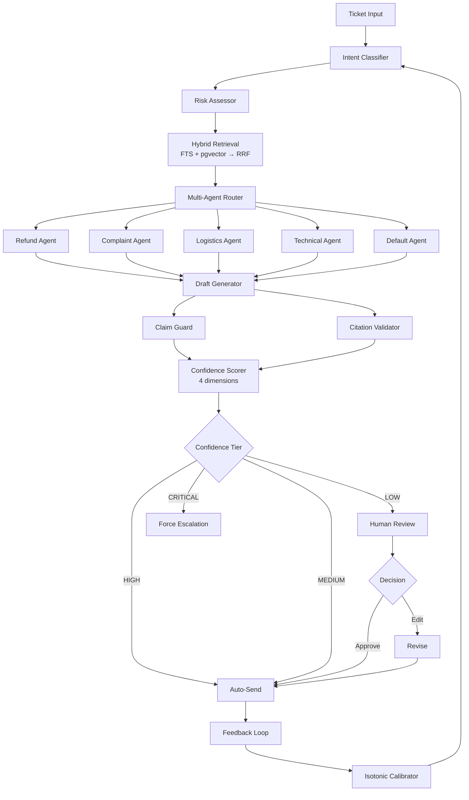

# TicketPilot

AI Customer Service Copilot for cross-border e-commerce — **deterministic, no-LLM-in-pipeline, full-chain traceability**.

> TicketPilot chains intent classification, risk assessment, evidence retrieval, draft generation, and human review into a single pipeline. Human agents only need to judge the ~20% of tickets that actually require judgment.

## What Makes TicketPilot Different

| Feature | Typical Approach | TicketPilot |
|---------|-----------------|-------------|
| Confidence scoring | Binary (confident / not) | 4-dimensional weighted: retrieval + classification + citation + evidence density |
| Response routing | All-auto or all-human | 4-tier degradation: AUTO_SEND → CAUTIOUS → HUMAN_REVIEW → ESCALATION |
| Hallucination guard | None or simple keyword filter | 8-category forbidden promise detection (refund amounts, legal threats, etc.) |
| Retrieval | Simple vector search | Keyword FTS + Vector HNSW → RRF fusion with per-ranker contribution tracing |
| Traceability | None | Full chain: answer → citation → chunk → document (ClaimProvenance + RetrievalTrace) |
| Agent architecture | Single agent | Multi-agent orchestrator with intent-based routing to 5 specialized agents |
| Pipeline determinism | LLM-dependent | Rule-driven, zero LLM calls in pipeline |
| Calibration | Static thresholds | Feedback loop with isotonic regression calibration + reliability diagrams |
| Experimentation | Manual A/B | Built-in A/B experiment framework with comparison reports |
| Self-reflection | None | Skill seed learning from successful draft patterns |

## Architecture



## Key Modules

### Confidence & Routing
- **ConfidenceScorer** — 4-dimensional scoring (retrieval 35%, classification 25%, citation 25%, evidence density 15%)
- **DegradationRouter** — 4-tier routing based on confidence level
- **Claim Guard** — Forbidden promise detection, citation coverage, risk acknowledgment
- **Citation Validator** — Luhn bank card check, unsupported claim detection

### Multi-Agent System
- **Orchestrator** — Intent-based routing to specialized agents
- **5 Specialists** — RefundAgent, ComplaintAgent, LogisticsAgent, TechnicalAgent, DefaultAgent
- **Per-agent prompt templates** — Each specialist uses domain-specific prompts
- **Self-Reflection Skills** — Agents learn from successful draft patterns via skill seed

### Retrieval
- **Hybrid search** — PostgreSQL FTS + pgvector HNSW → RRF fusion
- **RetrievalTrace** — Full explainability: keyword rank, vector rank, RRF contribution per result
- **Context truncation** — Token-budget-aware truncation for retrieval results

### Feedback & Calibration
- **FeedbackCollector** — Records (confidence, action, was_correct) from human reviews
- **CalibrationCurve** — 5-bucket reliability analysis with ECE
- **IsotonicCalibrator** — Pure Python PAV algorithm for confidence calibration
- **ThresholdAdvisor** — Suggests optimal thresholds based on calibration data
- **ReliabilityDiagram** — ASCII art visualization for terminal

### Evaluation & Experimentation
- **NLI Scorer** — Sentence decomposition, synonym expansion, negation detection
- **Retrieval Metrics** — Precision@K, Recall@K, MRR, NDCG
- **A/B Experiment Framework** — Same tickets, two configs, comparison report
- **Human Review Accuracy** — Precision/recall/F1 for review trigger correctness

### Dashboard & Visualization
- **Confidence Dashboard** — Streamlit visualization of confidence distribution and tier routing
- **Retrieval Visualization** — Streamlit table + contribution chart for retrieval traces
- **Human Review Console** — Review interface with approve/edit/escalate/reject actions
- **Chat UI** — Multi-turn conversation interface with evidence panel and risk escalation

### Observability
- **AgentTrace** — Append-only event stream per run
- **ClaimProvenance** — Answer → citation → chunk → document traceability
- **Provider Latency Measurement** — Benchmark script for LLM provider comparison

## Quick Start

### One-Click Demo

```bash
# Check Docker, start DB, seed data, run demo, optionally launch dashboard
bash scripts/demo.sh
```

### Manual Setup

```bash
git clone https://github.com/yourusername/ticketpilot.git
cd ticketpilot

pip install uv
uv sync

cp .env.example .env.local
# Edit .env.local with your API keys (optional — pipeline works without LLM keys)

docker compose up -d db

uv run python scripts/ingest_knowledge.py

uv run uvicorn ticketpilot.api:app --host 0.0.0.0 --port 8000
```

### Run Tests

```bash
# Unit tests (no database required)
TICKETPILOT_SKIP_DB_TESTS=1 uv run pytest tests/ --ignore=tests/integration -q

# Full quality gate
bash scripts/run_quality_gate.sh
```

### Review Console

```bash
uv run streamlit run src/ticketpilot/review/console.py --server.port 8501
```

### Dashboard

```bash
uv run python scripts/run_dashboard.py
```

### Calibration & Feedback

```bash
# Run calibration with reflection data
uv run python scripts/calibrate_with_reflection.py

# Run A/B threshold experiment
uv run python scripts/run_threshold_ab.py
```

## API Endpoints

| Endpoint | Method | Description |
|----------|--------|-------------|
| `/api/health` | GET | Health check |
| `/api/chat` | POST | Chat with AI copilot |
| `/api/chat/stream` | POST | Streaming chat (SSE) |
| `/api/tickets` | POST | Process ticket |
| `/api/reviews` | POST | Submit review decision |
| `/api/evaluation` | GET | Get evaluation metrics |

## Project Structure

```
src/ticketpilot/
├── api/                # FastAPI endpoints + SSE streaming
├── classification/     # Intent classifier (deterministic, 8 classes)
├── config/             # Central confidence thresholds
├── confidence/         # 4-dimensional confidence scorer
├── degradation/        # 4-tier response router
├── drafting/           # DraftAgent, prompt builder, claim guard, citation validator
├── evaluation/         # RAGAS-style metrics, NLI scorer, retrieval metrics, A/B experiments
├── experiment/         # A/B experiment framework (Config + Runner + Reporter)
├── feedback/           # Feedback collector, calibrator, threshold advisor
├── guardrails/         # PII detection, security scanning
├── intake/             # Ticket normalization, entity extraction
├── multi_agent/        # Orchestrator + 5 specialized agents
├── prompts/            # Per-agent prompt templates
├── retrieval/          # Hybrid retrieval (FTS + HNSW → RRF)
├── review/             # Streamlit review console, retrieval visualization
├── risk/               # Risk assessor + rules (8 flag types, 3 severity)
├── schema/             # Pydantic data models
├── tracing/            # Provenance tracking
└── triggers/           # CLI + webhook entry points
```

## Test Coverage

```
1,662 tests passing
├── Unit tests (no DB): 1,662
├── Integration tests (DB required): separate
└── Coverage: 87% (>= 70% enforced)
```

## Portfolio

See [docs/portfolio/index.md](docs/portfolio/index.md) for the project elevator pitch, architecture diagram, and key metrics.

## License

MIT
