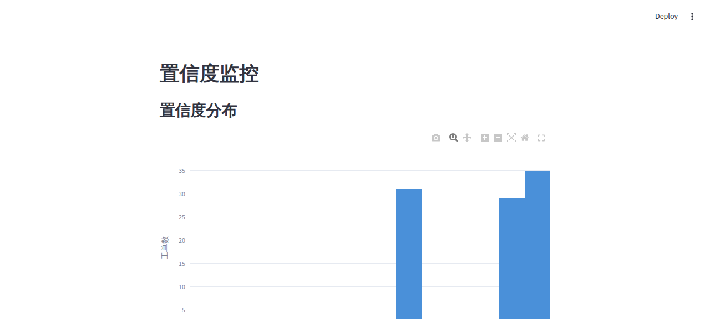
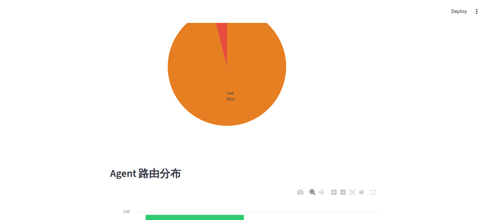
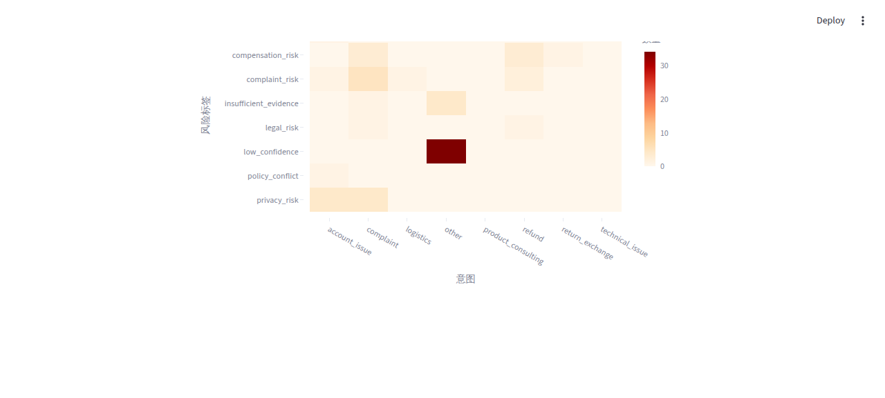
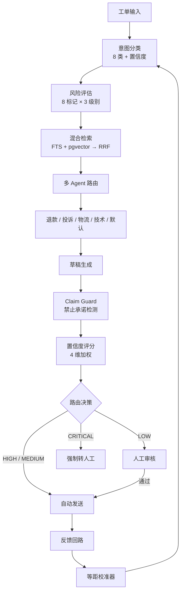

# 🎫 TicketPilot

**中文客服工单 AI 分拣系统 — 确定性管线，零 LLM 调用，全链路可追溯**

> 跨境电商客服 Copilot：意图分类 → 风险评估 → 混合检索 → 证据化草稿 → 人工审核台
> 60% 工单自动发送，40% 路由到人工，0% 关键工单遗漏

[]()
[]()
[]()
[](LICENSE)
[]()

---

## 为什么做这个项目

大多数 AI 客服 demo 回避了最难的问题：**你怎么知道 LLM 没有在胡说？哪些工单需要人来判断？错误的回答怎么追溯到源头？**

TicketPilot 用工程手段回答这些问题：

- **管线内零 LLM 调用** — 分类、风险、检索、评分全部确定性执行，结果可复现
- **混合检索而非纯向量** — 关键词 FTS + pgvector HNSW → RRF 融合 → 4 信号混合重排序
- **4 层置信度路由** — HIGH/MEDIUM 自动发送，LOW 人工审核，CRITICAL 强制转人工
- **8 类禁止承诺检测** — 退款金额、法律威胁、隐私承诺等，AI 草稿不会越线

> Portfolio demo project. All data is synthetic.

---

## 截图

| 监控大盘 | 置信度分布 | 意图×风险热力图 |
|:---:|:---:|:---:|
|  |  |  |

---

## 30 秒上手

```bash
git clone https://github.com/lennney/ticketpilot.git && cd ticketpilot

pip install uv && uv sync           # 安装依赖
docker compose up -d db              # 启动 PostgreSQL + pgvector
uv run python scripts/ingest_knowledge.py   # 灌入知识库

uv run uvicorn ticketpilot.api:app --port 8000   # 启动 API
```

```bash
# 一键 demo（灌数据 + 启动服务 + 跑评测）
bash scripts/demo.sh
```

```bash
# 人工审核台
uv run streamlit run src/ticketpilot/review/console.py --server.port 8501
```

---

## 架构



---

## 和普通 RAG 的区别

| 维度 | 典型 RAG | TicketPilot |
|------|---------|-------------|
| 检索 | 单路向量搜索 | 关键词 FTS + 向量 HNSW → RRF → **4 信号混合重排序** |
| 置信度 | 二元（自信/不自信） | 4 维加权：检索 35% + 分类 25% + 引用 25% + 证据密度 15% |
| 路由 | 全自动或全人工 | 4 层降级：AUTO → CAUTIOUS → HUMAN_REVIEW → ESCALATION |
| 幻觉防护 | 无 | 8 类禁止承诺检测（退款金额、法律威胁等） |
| 可追溯性 | 无 | 全链路：回答 → 引用 → chunk → 文档 |
| Agent 架构 | 单 Agent | 5 个专职 Agent + 意图路由 |
| 管线确定性 | 依赖 LLM | 规则驱动，管线内零 LLM 调用 |
| 校准 | 静态阈值 | 反馈回路 + 等距回归 + 可靠性图 |

---

## API

| 端点 | 方法 | 说明 |
|------|------|------|
| `/api/tickets` | POST | 提交工单处理 |
| `/api/chat` | POST | 对话式 Copilot |
| `/api/chat/stream` | POST | SSE 流式响应 |
| `/api/reviews` | POST | 提交人工审核决策 |
| `/api/evaluation` | GET | 评测指标 |

---

## 测试

```bash
# 单元测试（无需数据库）
TICKETPILOT_SKIP_DB_TESTS=1 uv run pytest tests/ --ignore=tests/integration -q

# 完整质量门禁（lint + 测试 + 集成 + openspec + 密钥扫描）
bash scripts/run_quality_gate.sh
```

```
1,760 tests passing · 87% coverage · ≥ 70% enforced
```

---

## 项目结构

```
src/ticketpilot/
├── api/                # FastAPI + SSE 流式
├── classification/     # 意图分类（确定性，8 类）
├── confidence/         # 4 维置信度评分
├── degradation/        # 4 层响应路由
├── drafting/           # 草稿生成 + Claim Guard + 引用验证
├── evaluation/         # NLI 评分、检索指标、A/B 实验
├── feedback/           # 反馈收集、等距校准、阈值顾问
├── guardrails/         # PII 检测、安全扫描
├── multi_agent/        # 编排器 + 5 专职 Agent
├── retrieval/          # 混合检索（FTS + HNSW → RRF → 混合重排序）
│   ├── hybrid_reranker.py    # 多信号加权重排序
│   ├── query_expander.py     # LLM 查询扩展
│   ├── result_merger.py      # 多变体结果合并
│   └── reranker_config.py    # YAML 可配置权重
├── review/             # Streamlit 人工审核台
├── risk/               # 风险评估（8 标记，3 级别）
├── schema/             # Pydantic 数据模型
└── tracing/            # 来源追溯
```

---

## 参与贡献

欢迎 PR！适合入门的方向：

- 📝 **文档** — 中英文使用示例、架构说明
- 🧪 **测试** — 检索/分类的边界 case
- 🔧 **Bug 修复** — 看 [Issues](https://github.com/lennney/ticketpilot/issues)
- 🌐 **国际化** — 审核台多语言支持

```bash
uv sync --group dev    # 安装开发依赖
uv run pytest tests/ -v
bash scripts/run_quality_gate.sh   # 提 PR 前跑一下
```

---

## 技术文档

- [检索架构](docs/technical/retrieval_architecture.md) — 混合检索管线详解
- [质量门禁](docs/technical/quality_gate.md) — 测试和验证规则
- [项目 Portfolio](docs/portfolio/index.md) — 指标和 elevator pitch

---

## License

MIT
