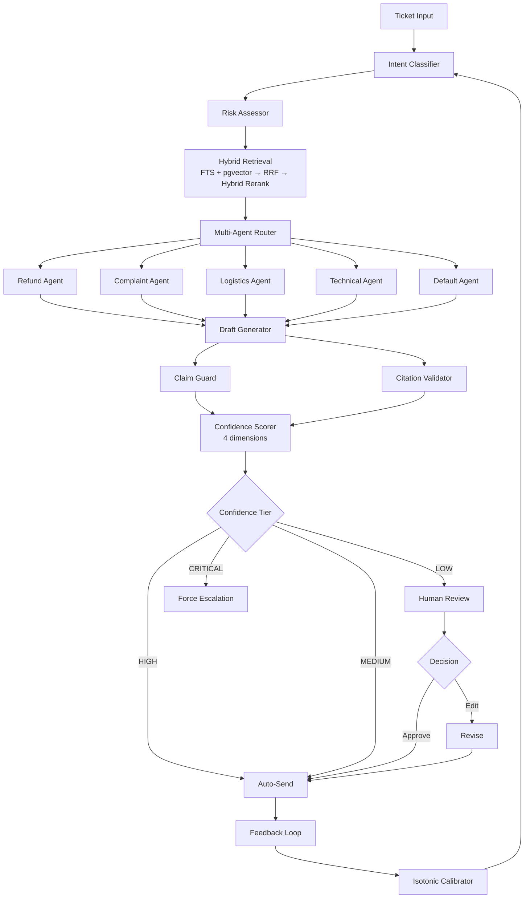

# TicketPilot

[]()
[]()
[]()
[](LICENSE)
[]()

**AI Customer Service Copilot for cross-border e-commerce — deterministic pipeline, full-chain traceability, hybrid retrieval.**

TicketPilot triages customer tickets through intent classification, risk assessment, hybrid evidence retrieval, and draft generation — then routes only the ~20% that need human judgment to a review console. The pipeline is fully deterministic (zero LLM calls), with every decision traceable from answer → citation → chunk → document.

> This is a portfolio project demonstrating production-grade RAG architecture patterns. All data is synthetic.

---

## Why I Built This

Most AI customer service demos hide the hard parts: how do you know the LLM isn't hallucinating? How do you decide which tickets need a human? How do you trace a wrong answer back to its source?

TicketPilot answers these questions with engineering, not prompts:

- **No black boxes** — every retrieval, classification, and confidence score is explainable
- **No hallucination risk in the pipeline** — LLM is only used for draft generation, with 8-category forbidden-promise detection
- **Hybrid retrieval that works** — keyword FTS + vector HNSW → RRF fusion → multi-signal reranking
- **Confidence you can calibrate** — 4-dimensional scoring with isotonic regression, not arbitrary thresholds

---

## Screenshots

### Confidence Monitoring Dashboard


### Tier & Agent Routing Distribution


### Intent × Risk Label Heatmap


## Architecture



## What Makes It Different

| Feature | Typical RAG | TicketPilot |
|---------|------------|-------------|
| Retrieval | Single vector search | Keyword FTS + Vector HNSW → RRF → **4-signal hybrid reranking** |
| Confidence | Binary (confident / not) | 4-dimensional weighted: retrieval + classification + citation + evidence density |
| Routing | All-auto or all-human | 4-tier degradation: AUTO → CAUTIOUS → HUMAN_REVIEW → ESCALATION |
| Hallucination guard | None or keyword filter | 8-category forbidden promise detection (refund amounts, legal threats, etc.) |
| Traceability | None | Full chain: answer → citation → chunk → document |
| Agent architecture | Single agent | Multi-agent orchestrator with intent-based routing to 5 specialists |
| Pipeline determinism | LLM-dependent | Rule-driven, zero LLM calls in pipeline |
| Calibration | Static thresholds | Feedback loop with isotonic regression + reliability diagrams |
| Self-reflection | None | Skill seed learning from successful draft patterns |

## Hybrid Retrieval Pipeline

```
Query → LLM Query Expansion (2 variants)
      → Parallel Retrieval (keyword FTS + vector HNSW per variant)
      → RRF Fusion (k=60)
      → Multi-variant Merge (sum_score dedup)
      → Hybrid Reranker (4-signal weighted fusion):
          ├── RRF score              (weight: 0.40)
          ├── Embedding similarity   (weight: 0.25)
          ├── Intent metadata boost  (weight: 0.20)
          └── Content quality        (weight: 0.15)
      → Top-K Evidence + Full RetrievalTrace
```

The reranker is fully configurable via `config/reranker.yaml` — weights, intent boost tables, and content quality parameters are all externalized for A/B experimentation.

## Key Modules

### Confidence & Routing
- **ConfidenceScorer** — 4-dimensional scoring (retrieval 35%, classification 25%, citation 25%, evidence density 15%)
- **DegradationRouter** — 4-tier routing based on confidence level
- **Claim Guard** — Forbidden promise detection, citation coverage, risk acknowledgment

### Multi-Agent System
- **Orchestrator** — Intent-based routing to specialized agents
- **5 Specialists** — RefundAgent, ComplaintAgent, LogisticsAgent, TechnicalAgent, DefaultAgent
- **Self-Reflection Skills** — Agents learn from successful draft patterns

### Retrieval
- **Hybrid search** — PostgreSQL FTS + pgvector HNSW → RRF fusion
- **Hybrid Reranker** — Multi-signal weighted fusion (RRF + embedding + intent + content quality)
- **Query Expansion** — LLM-generated query variants for improved recall
- **RetrievalTrace** — Full explainability with per-signal breakdown

### Feedback & Calibration
- **FeedbackCollector** — Records (confidence, action, was_correct) from human reviews
- **IsotonicCalibrator** — Pure Python PAV algorithm for confidence calibration
- **ReliabilityDiagram** — ASCII art visualization for terminal

### Evaluation
- **NLI Scorer** — Sentence decomposition, synonym expansion, negation detection
- **Retrieval Metrics** — Precision@K, Recall@K, MRR, NDCG
- **A/B Experiment Framework** — Same tickets, two configs, comparison report

## Quick Start

```bash
git clone https://github.com/lennney/ticketpilot.git
cd ticketpilot

pip install uv
uv sync

cp .env.example .env.local
# Edit .env.local with your API keys (optional — pipeline works without LLM keys)

docker compose up -d db

uv run python scripts/ingest_knowledge.py

uv run uvicorn ticketpilot.api:app --host 0.0.0.0 --port 8000
```

### One-Click Demo

```bash
bash scripts/demo.sh
```

### Run Tests

```bash
# Unit tests (no database required)
TICKETPILOT_SKIP_DB_TESTS=1 uv run pytest tests/ --ignore=tests/integration -q

# Full quality gate (lint + tests + integration + openspec + secret scan)
bash scripts/run_quality_gate.sh
```

### Review Console & Dashboard

```bash
# Human review interface
uv run streamlit run src/ticketpilot/review/console.py --server.port 8501

# Metrics dashboard
uv run python scripts/run_dashboard.py
```

## API Endpoints

| Endpoint | Method | Description |
|----------|--------|-------------|
| `/api/health` | GET | Health check |
| `/api/chat` | POST | Chat with AI copilot |
| `/api/chat/stream` | POST | Streaming chat (SSE) |
| `/api/tickets` | POST | Process ticket |
| `/api/reviews` | POST | Submit review decision |
| `/api/evaluation` | GET | Get evaluation metrics |

## Project Structure

```
src/ticketpilot/
├── api/                # FastAPI endpoints + SSE streaming
├── classification/     # Intent classifier (deterministic, 8 classes)
├── confidence/         # 4-dimensional confidence scorer
├── degradation/        # 4-tier response router
├── drafting/           # DraftAgent, claim guard, citation validator
├── evaluation/         # NLI scorer, retrieval metrics, A/B experiments
├── experiment/         # A/B experiment framework
├── feedback/           # Feedback collector, calibrator, threshold advisor
├── guardrails/         # PII detection, security scanning
├── intake/             # Ticket normalization, entity extraction
├── multi_agent/        # Orchestrator + 5 specialized agents
├── retrieval/          # Hybrid retrieval (FTS + HNSW → RRF → hybrid rerank)
│   ├── hybrid_reranker.py    # Multi-signal weighted reranking
│   ├── query_expander.py     # LLM query expansion
│   ├── result_merger.py      # Multi-variant result merging
│   └── reranker_config.py    # YAML-configurable weights
├── review/             # Streamlit review console
├── risk/               # Risk assessor (8 flag types, 3 severity)
├── schema/             # Pydantic data models
├── tracing/            # Provenance tracking
└── triggers/           # CLI + webhook entry points
```

## Test Coverage

```
1,662 tests passing
├── Unit tests (no DB): 1,662
├── Integration tests (DB required): separate
└── Coverage: 87% (>= 70% enforced)
```

## Contributing

Contributions welcome! Good first issues:

- 📝 **Documentation** — Improve Chinese/English docs, add usage examples
- 🧪 **Test coverage** — Add edge case tests for retrieval or classification
- 🔧 **Bug fixes** — Check [Issues](https://github.com/lennney/ticketpilot/issues) for open bugs
- 🌐 **Internationalization** — Add multi-language support for the review console

```bash
# Setup dev environment
uv sync --group dev
uv run pytest tests/ -v

# Run quality gate before submitting PR
bash scripts/run_quality_gate.sh
```

## Technical Docs

- [Retrieval Architecture](docs/technical/retrieval_architecture.md) — Hybrid retrieval pipeline deep dive
- [Validation Policy](docs/technical/validation_policy.md) — Testing and quality gate rules
- [Portfolio](docs/portfolio/index.md) — Project elevator pitch and key metrics

## License

MIT
