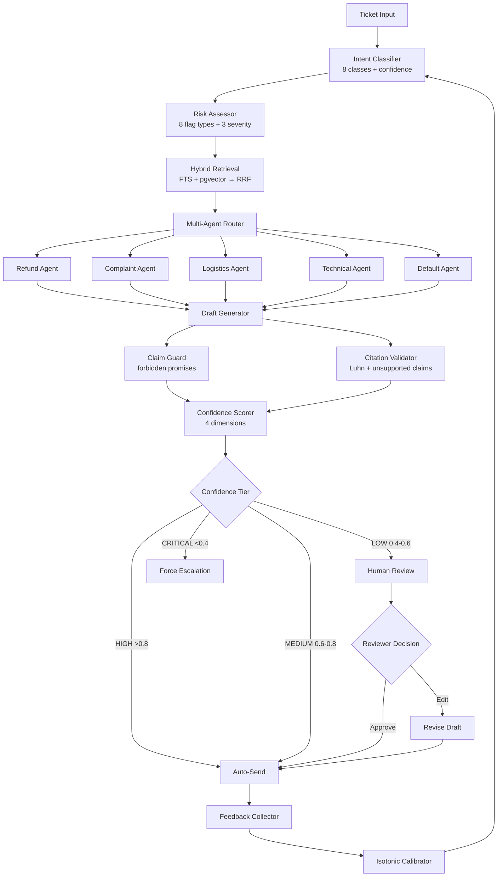

# TicketPilot — AI Customer Service Triage System

> A deterministic, LLM-free-in-pipeline customer service triage system.
> Core value: handle the most tickets with the least human intervention.

## The Pitch

TicketPilot chains intent classification, risk assessment, evidence retrieval, draft generation, and human review into a single pipeline. Human agents only need to judge the ~20% of tickets that actually require judgment — the rest flows through automatically with full traceability.

## Key Metrics

| Metric | Value | Source |
|--------|-------|--------|
| Eval tickets processed | 101 | Synthetic eval set |
| Auto-send rate | 60% | HIGH + MEDIUM confidence |
| Human review rate | 40% | LOW confidence tier |
| Risk miss rate | 0% | All CRITICAL tickets intercepted |
| Test suite | 1,662 passing | 87% coverage |
| Retrieval Recall@10 | 91.9% | Doc-ID level |
| Knowledge chunks | 340 | FAQ + Policy + Case |
| Agents | 5 | Refund, Complaint, Logistics, Technical, Default |
| Risk flag types | 8 | complaint, compensation, legal, privacy, account_security, policy_conflict, low_confidence, insufficient_evidence |

## Architecture



## Design Decisions

| Decision | Why |
|----------|-----|
| Deterministic pipeline | Customer service can't tolerate LLM hallucinations in classification/risk |
| 4-dimensional confidence | Single keyword match gave 90% of tickets the same score — useless for routing |
| Self-reflection skills | Learn from successful cases instead of starting from scratch each time |
| Tiered auto-send | 80/20 rule: 80% of tickets don't need a human |
| Feedback loop with calibration | Confidence thresholds need data-driven tuning, not gut feeling |
| Hybrid retrieval (FTS + vector) | Keyword search misses semantic matches; vector search misses exact terms |
| Per-agent prompt templates | A refund agent and a complaint agent need different tones and policies |
| Claim guard | Prevent the LLM from making unauthorized promises (refunds, legal threats) |

## Confidence → Strategy Mapping

| Confidence | Tier | Strategy | Behavior |
|------------|------|----------|----------|
| > 0.8 | HIGH | AUTO_SEND | Auto-send, background audit |
| 0.6–0.8 | MEDIUM | AUTO_SEND_CAUTIOUS | Auto-send + disclaimer |
| 0.4–0.6 | LOW | HUMAN_REVIEW | Human review before send |
| < 0.4 | CRITICAL | HUMAN_ESCALATION | Escalate to human, no draft |

## Modules

| Module | Purpose |
|--------|---------|
| `classification/` | 8-class intent classifier with multi-signal confidence |
| `risk/` | 8 risk flag types, 3 severity levels |
| `retrieval/` | FTS + pgvector HNSW → RRF fusion with contribution tracing |
| `multi_agent/` | Orchestrator + 5 specialized agents |
| `drafting/` | DraftAgent with self-reflection skills + claim guard |
| `confidence/` | 4D scorer: retrieval 35%, classification 25%, citation 25%, evidence 15% |
| `degradation/` | 4-tier router: AUTO_SEND → CAUTIOUS → HUMAN_REVIEW → ESCALATION |
| `feedback/` | FeedbackCollector + CalibrationCurve + IsotonicCalibrator + ThresholdAdvisor |
| `experiment/` | A/B experiment framework with comparison reports |
| `evaluation/` | NLI-based faithfulness + retrieval metrics (Precision@K, Recall@K, MRR, NDCG) |
| `review/` | Streamlit review console + retrieval visualization |
| `dashboard/` | Confidence distribution, agent routing, risk coverage dashboards |

## Quick Start

```bash
# One-click demo
bash scripts/demo.sh

# Or manual steps:
docker compose up -d                    # Start PostgreSQL + pgvector
uv sync                                 # Install dependencies
uv run python scripts/ingest_knowledge.py  # Seed knowledge base
uv run pytest tests/ -q --tb=no         # Run tests
```

## Screenshots

| Confidence Distribution | Agent Routing |
|------------------------|---------------|
|  |  |

| Risk Coverage |
|---------------|
|  |

## Limitations

- Offline evaluation on 101 synthetic tickets — not a production benchmark
- Fake embedding provider by default (deterministic, no API key required)
- No real customer data, no live traffic
- Chat UI is MVP-level, UX polish is iterative
