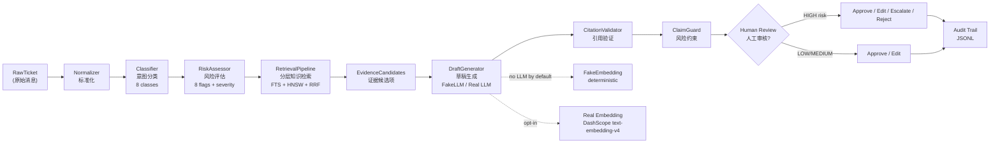
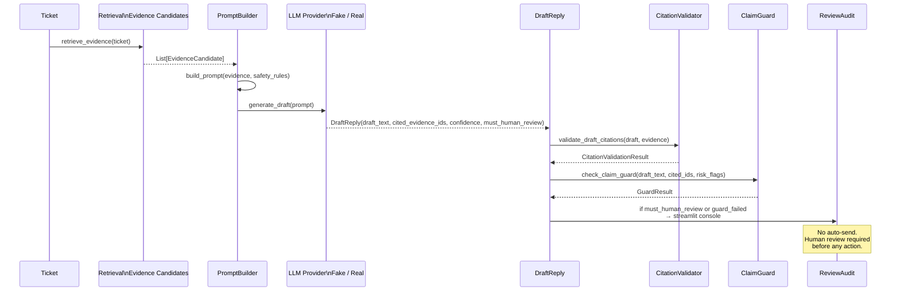
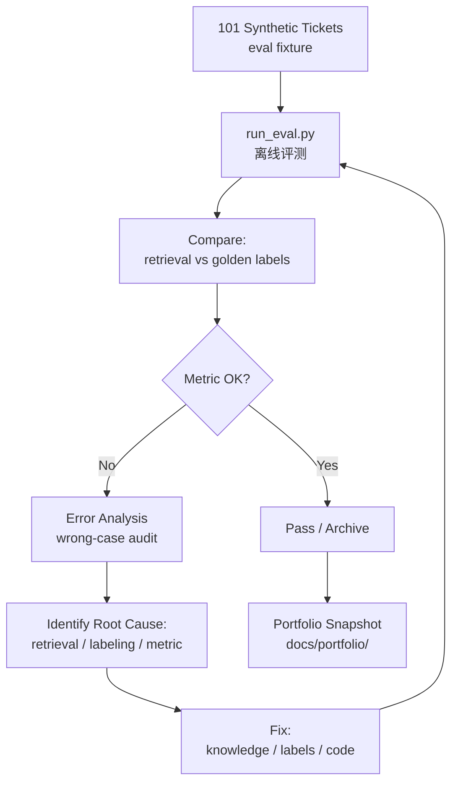

# Phase 12 Visual Explanation Pack

**Scope**: Local demo / portfolio prototype
**Generated**: 2026-05-07
**Purpose**: Mermaid diagrams and shot lists for Notion portfolio pages, demos, and interviews

---

## A. Overall Workflow



**Caption**: End-to-end TicketPilot pipeline: intake → classification → risk assessment → retrieval → draft generation → citation validation → claim guard → human review. Human review is mandatory for HIGH risk cases. No auto-send at any point.

---

## B. Evidence-Grounded Draft Trace



**Caption**: Evidence-grounded draft generation trace. The same evidence list is used for prompt building, citation validation, and claim guard checking. All checks are deterministic except the LLM call (real provider only).

---

## C. Evaluation Loop



**Caption**: Offline evaluation loop used in Phase 7–12. Every phase ran this cycle: evaluate → diagnose → fix → re-evaluate. No live traffic required. All conclusions drawn from synthetic fixtures.

---

## D. Provider Comparison

```mermaid
flowchart LR
    A["25-Case Fixture Set\nfixed synthetic cases"] --> B1["FakeLLMProvider\ndefault, no network"]
    A --> B2["OpenAICompatibleProvider\nopt-in, real API"]
    B1 --> C1["Success: 25/25\nConfidence: 0.85\nHR triggers: 8"]
    B2 --> C2["Success: 25/25\nConfidence: 0.70\nHR triggers: 8\nAPI errors: 0"]
    C1 --> D["Compare\nidentical HR pattern"]
    C2 --> D
    D --> E["Report\ndocs/portfolio/\nphase12_provider_comparison_analysis.md"]
    Note over E: Not a benchmark.\nOffline fixture-based only.
```

**Caption**: Phase 12 provider comparison. Same fixture set, same evidence (mock), different provider. Both succeeded on all 25 cases with identical human review triggers — confirming the risk rule is provider-agnostic.

---

## E. Screenshot / Video Shot List

### Shot 1: Pipeline Input → Output
```
Title:     TicketPilot — Ticket Processing Demo
Content:   Raw ticket input → Normalized ticket → Classification → Risk flags → Draft reply
Tool:      Streamlit console (src/ticketpilot/review/console.py)
Duration:  30 seconds
Key:       Show the structured output fields, not the raw draft text
```

### Shot 2: Retrieval Trace
```
Title:     Evidence Retrieval Trace
Content:   Top-10 fused evidence candidates with scores, source types (FAQ/Policy/Case), similarity scores
Tool:      Streamlit or script output from scripts/run_phase10_real_doc_level_eval.py
Duration:  20 seconds
Key:       Show the RRF fusion producing ranked evidence, not just raw similarity
```

### Shot 3: Human Review Console
```
Title:     Human Review Console — Risk Flags and Guard Status
Content:   Streamlit console showing: risk flags, severity, draft text, citation validation, guard pass/fail, confidence, human review reasons
Tool:      Streamlit (uv run streamlit run src/ticketpilot/review/console.py)
Duration:  30 seconds
Key:       Show the approve/edit/escalate/reject buttons, and the must_human_review indicator
```

### Shot 4: Quality Gate Output
```
Title:     Quality Gate — All Checks Passed
Content:   Terminal output: ruff → unit tests → integration tests → coverage → OpenSpec → secret scan → PASSED
Tool:      Terminal (bash scripts/run_quality_gate.sh)
Duration:  15 seconds
Key:       Show 1069 unit + 146 integration + 87% coverage + PASSED
```

### Shot 5: Metrics Dashboard
```
Title:     Metrics Dashboard Summary
Content:   Table: Doc-ID Recall@10=91.9%, Fake 25/25, Real 25/25, Quality gate PASSED
Tool:      docs/portfolio/ticketpilot_metrics_dashboard.md
Duration:  10 seconds (display in portfolio page)
Key:       Show the boundary wording — "local demo / portfolio prototype"
```

### Shot 6: Phase 10 Diagnosis (optional)
```
Title:     Phase 10 Retrieval Diagnosis
Content:   Wrong-case recheck table showing 32/41 cases reclassified as metric granularity
Tool:      reports/retrieval/phase10_full_real_doc_level_wrong_case_recheck.md
Duration:  20 seconds
Key:       Show the thesis: 78% of wrong cases were measurement issues, not retrieval issues
```

---

## F. Notion Portfolio Page Layout

Suggested page structure for a Notion portfolio:

```
TicketPilot — Project Portfolio
├── 1. Project Overview (1 sentence + GitHub link)
│   └── Link: docs/portfolio/product_portfolio_material_pack.md
├── 2. Demo Video Section
│   ├── Shot 1: Pipeline demo (30s)
│   ├── Shot 2: Retrieval trace (20s)
│   ├── Shot 3: Human review console (30s)
│   └── Shot 4: Quality gate output (15s)
├── 3. Key Metrics Table
│   └── Link: docs/portfolio/ticketpilot_metrics_dashboard.md
├── 4. Architecture Diagram
│   └── Mermaid: Overall workflow (Section A above)
├── 5. Iteration Story
│   ├── Phase 7: Data foundation
│   ├── Phase 8: Real retrieval upgrade
│   ├── Phase 9: Knowledge optimization
│   ├── Phase 10: Retrieval diagnosis
│   ├── Phase 11: Draft generation
│   └── Phase 12: Provider comparison
├── 6. Safety Architecture
│   └── Link: docs/portfolio/phase11_evidence_draft_snapshot.md
├── 7. Case Studies
│   └── Link: docs/portfolio/phase12_case_studies.md
├── 8. Limitations & Boundary
│   └── Link: docs/portfolio/ticketpilot_metrics_dashboard.md (Section 7)
└── 9. Engineering Quality
    └── Link: docs/portfolio/phase12_error_analysis.md (Section 3)
```

**Note**: Keep all raw data links (JSON reports, evaluation logs) in a separate "Technical Artifacts" section — portfolio readers should see the summary, not the raw numbers.
