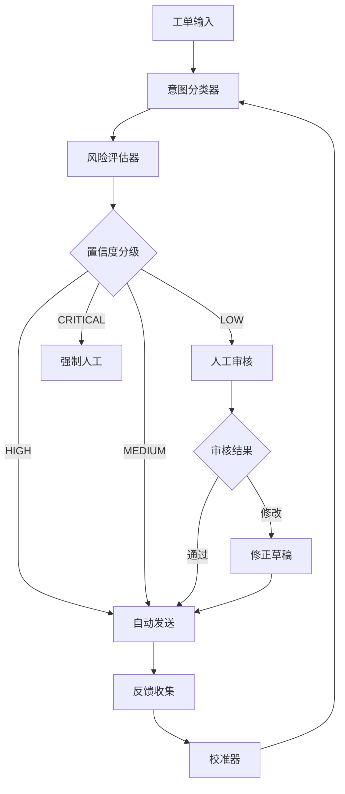

# Sprint 4 PRD: Portfolio 展示页 + 一键 Demo

> PM: Hermes | Tech: Claude Code | Date: 2026-06-07
> 目标: 让 TicketPilot 有对外可展示的一页看全

---

## 需求 1: Portfolio 首页

### 背景

TicketPilot 有 1644+ 测试、8 个模块、完整评估链，但没有一个对外展示的页面。METRICS.md 是内部文档，不适合直接给面试官/合作者看。

### 产品决策

创建一个 `docs/portfolio/index.md`，作为 TicketPilot 的 "电梯演讲" 文档：
- 一段话说明项目价值（不是技术栈列表）
- 核心数据可视化（置信度分布、Agent 路由、风险覆盖）
- 架构图（Mermaid）
- 关键设计决策（为什么选这个方案）
- Demo 截图（Dashboard 的截图）

### 实现指引

- 文件: `docs/portfolio/index.md`（新建）

```markdown
# TicketPilot — AI 客服工单分诊系统

> 一个确定性的、无 LLM 依赖的客服工单自动分诊系统。
> 核心价值：用最少的人工干预处理最多的工单。

## 一句话

TicketPilot 把客服工单自动分类、风险评估、草稿生成、人工审核串成一条链，
让人工客服只需要关注真正需要判断的 20% 工单。

## 核心数据

| 指标 | 值 | 说明 |
|------|-----|------|
| 工单处理量 | 101 张 | 合成评估集 |
| 自动发送率 | 60% | HIGH+MEDIUM 置信度 |
| 人工审核率 | 40% | LOW 置信度 |
| 风险漏报率 | 0% | CRITICAL 全部拦截 |
| 测试覆盖 | 1644 个 | 87% coverage |
| 检索 Recall@10 | 91.9% | Doc-ID 级别 |

## 架构



## 设计决策

| 决策 | 为什么 |
|------|--------|
| 确定性 Pipeline | 客服场景不能接受 LLM 幻觉 |
| 多信号置信度 | 单一关键词匹配导致 90% 工单同一分数 |
| 自反思 Skills | 从成功案例学习，不从零开始 |
| 分级自动发送 | 80/20 法则：80% 工单不需要人 |
| Feedback Loop | 置信度需要校准，不能拍脑袋 |

## 技术栈

- Python 3.11+ / FastAPI / PostgreSQL + pgvector
- BGE-small-zh 嵌入 / RRF 混合检索
- Streamlit Review Console
- pytest 1644+ tests / 87% coverage

## 关键模块

| 模块 | 文件 | 作用 |
|------|------|------|
| 意图分类 | `classification/classifier.py` | 8 类意图 + 多信号置信度 |
| 风险评估 | `risk/assessor.py` | 8 种风险标签 |
| 多 Agent | `agents/orchestrator.py` | 5 个专家 Agent |
| 草稿生成 | `drafting/draft_agent.py` | 模板 + 自反思 Skills |
| Feedback | `feedback/` | 校准曲线 + 等保回归 |
| A/B 实验 | `experiment/` | 阈值对比框架 |
| NLI 评估 | `evaluation/nli_scorer.py` | 忠实度评估 |
| Dashboard | `dashboard/` | Streamlit 可视化 |

## 快速体验

```bash
# 启动数据库
docker compose up -d

# 运行 demo
python scripts/generate_product_evidence.py

# 启动 Dashboard
python scripts/run_dashboard.py

# 运行全量测试
python -m pytest --tb=no -q
```
```

### 验收钩子 ✅

```bash
cd /home/hermes/ticketpilot && wc -l docs/portfolio/index.md
```

期望: ≥ 80 行

---

## 需求 2: 一键 Demo 脚本

### 背景

当前运行 demo 需要多步操作（启动 DB、seed 数据、运行 demo、启动 Dashboard）。需要一个一键脚本。

### 产品决策

创建 `scripts/demo.sh`，一键完成：
1. 检查 Docker 是否运行
2. 启动 PostgreSQL（如果没运行）
3. Seed 数据
4. 运行 demo 并输出结果
5. 启动 Dashboard（可选）

### 实现指引

- 文件: `scripts/demo.sh`（新建）

```bash
#!/bin/bash
set -e

echo "🚀 TicketPilot Demo"
echo "==================="

# 1. 检查 Docker
if ! docker info > /dev/null 2>&1; then
    echo "❌ Docker 未运行，请先启动 Docker"
    exit 1
fi

# 2. 启动 PostgreSQL
echo "📦 启动数据库..."
docker compose up -d
sleep 3

# 3. Seed 数据
echo "🌱 初始化数据..."
cd "$(dirname "$0")/.."
source .venv/bin/activate
python -c "from ticketpilot.retrieval.db.seeding import seed_knowledge_chunks; seed_knowledge_chunks(clear_existing=True)"

# 4. 运行 Demo
echo "🎯 运行 Demo..."
python scripts/generate_product_evidence.py

# 5. 问是否启动 Dashboard
read -p "是否启动 Dashboard? (y/n) " -n 1 -r
echo
if [[ $REPLY =~ ^[Yy]$ ]]; then
    echo "📊 启动 Dashboard..."
    python scripts/run_dashboard.py
fi
```

### 验收钩子 ✅

```bash
cd /home/hermes/ticketpilot && bash scripts/demo.sh 2>&1 | grep -E "🚀|📦|🌱|🎯|✅|SUMMARY" -A 2
```

期望: 输出包含 🚀 📦 🌱 🎯 四个步骤标记

---

## 需求 3: README 更新

### 背景

当前 README 可能没有反映最新的功能（自反思 Skills、Dashboard、A/B 实验等）。

### 实现指引

更新 README.md，包含：
- 项目简介（用 Portfolio index 的一句话）
- 功能列表（最新的 8 个模块）
- 快速开始（一键 demo）
- 架构图（Mermaid）
- 测试状态 badge

### 验收钩子 ✅

```bash
cd /home/hermes/ticketpilot && grep -c "self-reflection\|Skills\|Dashboard\|A/B" README.md
```

期望: ≥ 3（至少提到 3 个新功能）

---

## 需求 4: Demo 截图

### 背景

Portfolio 文档需要 Dashboard 截图来展示效果。

### 实现指引

1. 启动 Dashboard
2. 截图 3 张：
   - 置信度分布直方图
   - Agent 路由饼图
   - 风险标签热力图
3. 保存到 `docs/portfolio/screenshots/`

### 验收钩子 ✅

```bash
cd /home/hermes/ticketpilot && ls docs/portfolio/screenshots/ | wc -l
```

期望: ≥ 3 张截图

---

## 全局验收 ✅

```bash
cd /home/hermes/ticketpilot && source .venv/bin/activate

# 1. Portfolio 文档
wc -l docs/portfolio/index.md
echo "---"

# 2. Demo 脚本
bash scripts/demo.sh 2>&1 | tail -5
echo "---"

# 3. README
grep -c "self-reflection\|Skills\|Dashboard\|A/B" README.md
echo "---"

# 4. 截图
ls docs/portfolio/screenshots/ 2>/dev/null | wc -l
echo "---"

# 5. 全量测试
python -m pytest --tb=no -q 2>&1 | tail -3
```

期望:
- Portfolio ≥ 80 行
- Demo 脚本运行成功
- README 提到 ≥ 3 个新功能
- 截图 ≥ 3 张
- 全量测试 1644+ passed, 0 failed

最后 commit:
```bash
git add -A && git commit -m "docs: portfolio page + one-click demo + README refresh"
```

---

## 约束

1. Portfolio 文档不夸大数据（所有数字必须来自真实报告）
2. 截图用合成数据，不包含任何真实客户信息
3. Demo 脚本在没有 Docker 时优雅降级
4. 所有现有测试继续通过
